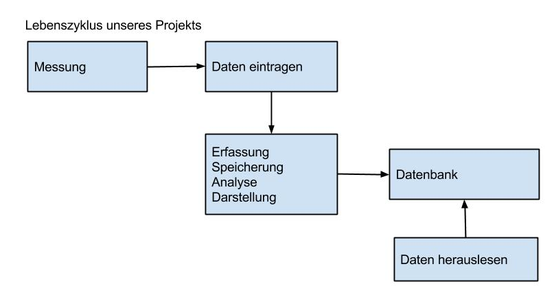
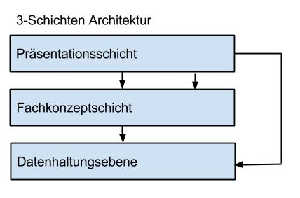

#Angebot (von Krach GmbH für Gewissen GmbH)

##Angebotsumfang

###       a. Beschreibung der Aufgabe
Die Gewissen GmbH strebt ein neues Lärmkataster-System an, welches einfach, effizient, effektiv und zuverlässig sein soll. Im Rahmen dieser Gesamtaufgabe soll Krach GmbH die Entwicklung, Installation und erste Schulungen des Systems übernehmen. Die Wartung des Lärmkataster-Systems ist im Angebot nicht enthalten.

###        b.Bezugsdokumente
Bezugsdokumente sind das Lastenheft, (das Pflichtenheft), der Budgetplan, die Anforderungsliste, die Protokolle der Meetings und die Reviews.
Für die Einhaltung der rechtlichen Vorschriften werden folgende Lärmschutzverordnungen berücksichtigt:
* Bundesimmissionsschutzgesetzt 
* Arbeitsschutzgesetz und Arbeitsstättenverordnung
* Maschinenrichtlinien und Maschinenverordnungen
* Lärm- und Vibrations-Arbeitsschutzverordnung
* Technische Anleitung zum Schutz gegen Lärm und Technische Regeln zur Lärm- und Vibrations-Arbeitsschutzverordnung 
* Unfallverhütungsvorschrift und Verordnung zur arbeitsmedizinischen Vorsorge
(Schreibweise noch falsch!! Lars fragen ob erforderlich)

###        c. Welche Leistung wird erbracht
Im Rahmen dieses Angebotes werden wir folgende Leistungen erbringen:
* Analyse des schon vorhandenen Ökosystems OpenResKit
* Analyse zu den geforderten Richtlinien und Verordnungen der Lärmmessungen
* Analyse und Einpflege von vorhandenen Daten
* Analyse der Arbeitsumgebung
* Implementierung für 
   * die dokumentierten Daten
   * die Visualisierung der Daten
   * die Speicherung der Daten
   * die Geräte der Messungen
* 

## Skizze des Lebenszykluses und der Gesamtarchitektur

###        d.Welche Ergebnisse werden am Ende geliefert
Liefergegenstände sind:
* Lauffähiges Programm
* Software -Source Code des Programms
* Dokumentationen

## 2. Rahmenbedingungen

###        a.Was umfasst das Angebot nicht
Das Angebot umfasst keine Wartung des Systems nach Ablauf des 17. Februar 2015. Das Lärmkataster wird nicht für Erweiterungen entwickelt. 

###        b.Welche Mitwirkungspflicht hat der Auftraggeber
Der Auftraggeber hat Mitteilungspflicht und muss Angaben zu Anforderungänderungen unmittelbar mitteilen. Zu Meetings muss der Auftraggeber immer selbst erscheinen. 
Der Auftraggeber stellt alle notwendigen Informationen und Dokumente kostenlos und frühzeitig zur Verfügung und wird gemeinsam mit der Krach GmbH alles Notwendige unternehmen, das Projekt gemeinsam erfolgreich abschließen zu können. Die Gewissen GmbH übernimmt nach Installation des Lärmkatasters  durch die Krach GmbH den vollständigen Betrieb und die Wartung. Die Krach GmbH übernimmt nur erste Einweisungen in das System und Erklärungen über dessen grundlegende Funktionen. 

###       c.Besondere Regelungen zur Zusammenarbeit oder zum Projektablauf
Die Dokumentation des Projektes enthält folgende Punkte: Zielstellung, Projektplanung, Anforderunganalyse, technische Konzeption, Implementierung.
Die Krach GmbH verpflichtet sich, jede Woche dienstags der Gewissen GmbH einen aktuellen Stand des Projektstatusses mitzuteilen. Frau Constanze Richter und Frau Johanna Terp von der Krach GmbH sind verpflichtet, jeden Dienstag Herrn Lars Schiemann von der Gewissen GmbH persönlich einen Projektstatus mitzuteilen und gegebenfalls neue Anforderungen zu besprechen. 

###        d.In welchem Zeitraum wird das Projekt abgewickelt
Die Leistung wird in der Zeit vom 01. Oktober bis zum 10. Februar 2015 erbracht. 

##3.Kommerzielle Regelungen

###        a.Preis : 55 085,00€ incl. MwST.

###        b.Zahlungsweise
Die Zahlung erfolgt nach folgenden Zahlungsmeilensteine:

| Nr | Beschreibung                 | Preis in Euro |
|----|------------------------------|---------------|
| 1  | bei Auftragerstellung        |     18.000,00 |
| 2  | bei Lieferung der Gui        |      9.000,00 |
| 3  | bei Lieferung des Prototypen |     13.000,00 |
| 4  | bei Installation             |     11.085,00 |
| 5  | bei Endabnahme               |      4.000,00 |

###        c.Lieferumfang und Abnahmeregelung
Alle Ergebnisse oder Teilergebnisse werden nach den folgendenen Regeln abgenommen:
Dokumente werden in Form von Reviews abgenommen. Für Software-Komponenten werden jeweils Testspezifikationen erstellt und dem Auftraggeber, der Gewissen GmbH, mindestens zwei Wochen vor dem jeweiligen Abnahmetermin zur Prüfung vorgelegt. Alle gewünschten Änderung werden schriftlich von der Gewissen GmbH der Krach GmbH innerhalb dieser zwei Wochen vorgelegt. Die Änderungenn werden von der Krach GmbH innerhalb von zwei Wochen in die Testspezifikation eingearbeitet. Nach Abnahme aller Liefergegenstände gilt das Projekt als abgeschlossen. Wird die Abnahme durch die Gewissen GmbH verweigert oder verzögert, so gelten alle Liefergegenstände dreißig Tage nach Erklärung der Abnahmebereitschaft als abgenommen. Die Abnahmebereitschaft wird durch die Krach GmbH schriftlich der Gewissen GmbH mitgeteilt. 

##4.Rechtliche Aspekte
Die Gewissen GmbH verpflichtet sich, das ausgelieferte System nur für ihre Zwecke zu nutzen. Das Unternehmen Gewissen GmbH darf den Source Code, das funktionstüchtige Programm oder die GUI nicht an Dritte weitergeben. 
Nach Abnahme des Systems durch die Gewissen GmbH ist die Krach GmbH rechtlich nicht mehr zu belangen.
